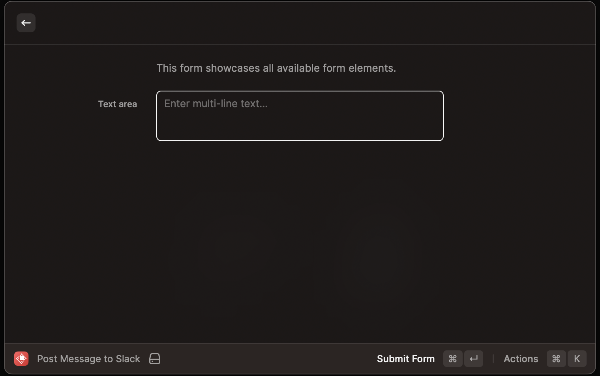

# Raycast Slack Times

Post messages on Slack using Raycast.



## How to Create an Access Token for the App

You need to create a Slack app and obtain an access token. Follow these steps:

1. Open https://api.slack.com/apps/
2. Click Button `Create New App`
3. Select `From an app manifest`
4. Select a workspace to which you want to grant the extension access.
5. Copy and paste the following manifest:

```
display_information:
  name: Raycast post message to slack
oauth_config:
  scopes:
    user:
      - chat:write
settings:
  org_deploy_enabled: false
  socket_mode_enabled: false
  token_rotation_enabled: false
```

6. Confirm creation of app
7. Press `Install to Workspace`
8. Get your personal access token from `Features -> OAuth & Permissions` (section `OAuth Tokens for Your Workspace`).  
   Your personal access token will start with `xoxp-`.

## How to Install in Your Raycast

Please refer to [Raycast Developer's Guide](https://developers.raycast.com/basics/create-your-first-extension) to install this extension.
